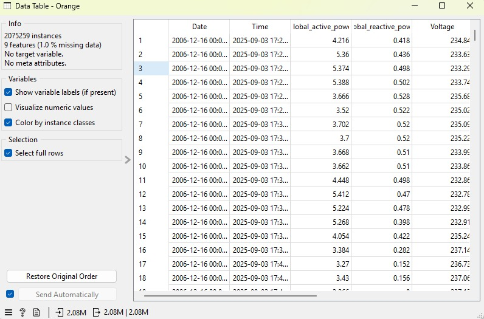
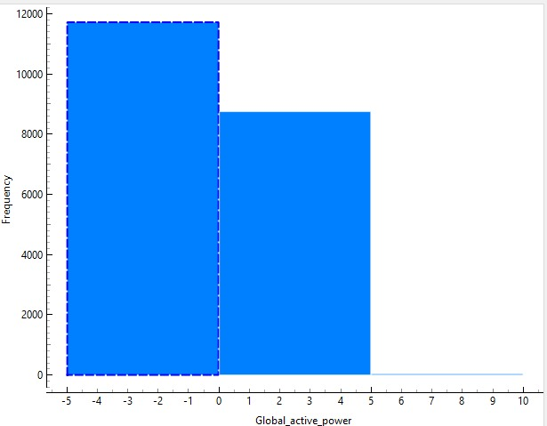
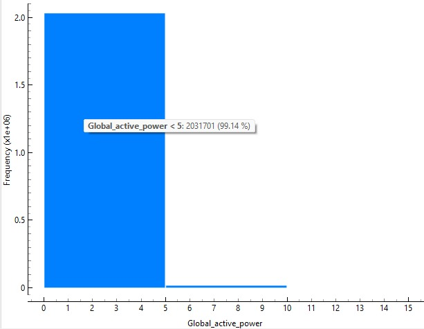
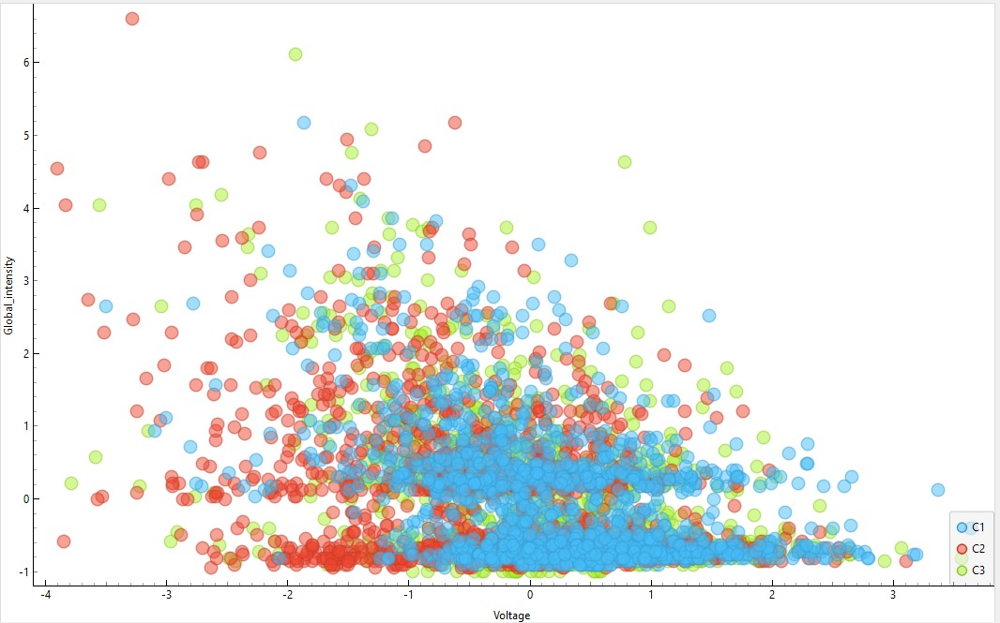
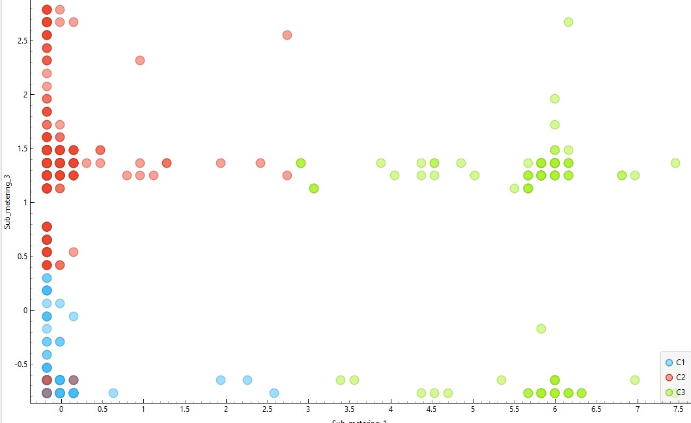

## Dedicado para responder as perguntas da parte 4 do CP1:

### Questão 36
Resposta: Há 2,08M de registros e 9 variáveis.

### Questão 37
Resposta: A distribuição é semelhante, mas com mais variação por causa do tamanho reduzido da amostra.

### Questão 38
Resposta: O consumo é concentrado em valores baixos. A distribuição mostra que a maioria dos registros está em faixas de consumo reduzido, com poucos casos de consumo elevado.

### Questão 39
Resposta: Não há correlação visível entre Voltage e Global_intensity. Os dados estão dispersos no gráfico, sem padrão claro de aumento ou queda, o que indica ausência de relação linear forte entre essas variáveis.

### Questão 40
Resposta: Sim, cada cluster representa um padrão distinto de consumo doméstico. Os grupos formados pelo K-Means mostram comportamentos diferentes nos submedidores, sugerindo perfis variados de uso de energia em diferentes áreas da casa.

